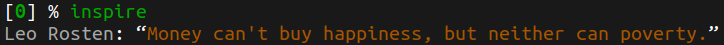

# zsh-random-quotes

Custom [zsh](https://www.zsh.org/) plugin to generate random Quotes and Facts(nerd, funny, love, inspire, facts).

## How to use?

It's super easy to use. Just type any of `nerd/funny/love/inspire/facts` in your terminal and enjoy.

## How to Install?

Depending on the plugin manager you use, add following to your `.zshrc` file and source it.

### [oh-my-zsh](https://github.com/ohmyzsh/ohmyzsh)

1. Clone the repo into your custom plugins folder, usually at (~/.oh-my-zsh/custom/plugins/)

   ```bash
   git clone https://gitlab.com/vkolagotla/zsh-random-quotes.git ~/.oh-my-zsh/custom/plugins/zsh-random-quotes
   ```

2. Add `zsh-random-quotes` to .zshrc plugins list, usually at (~/.zshrc)

   ```shell
   plugins=(... zsh-random-quotes)
   ```

### [Zplug](https://github.com/zplug/zplug)

```shell
zplug "vkolagotla/zsh-random-quotes"
```

### [Antigen](https://github.com/zsh-users/antigen)

```shell
antigen bundle "vkolagotla/zsh-random-quotes"
```

### [Zgen](https://github.com/tarjoilija/zgen)

```shell
zgen load "vkolagotla/zsh-random-quotes"
```

Source .zshrc file

```shell
source ~/.zshrc
```

**Sample outputs**





## TODO

- [ ] Add more categories

## About LICENSE

I created this plugin for personal use. The plugin [LICENSE](LICENSE) is only valid for the code. Since the quotes are fetched from an external source(online), i do not own that data. I would suggest you to not use the plugin for any commercial purpose, unless you have the permission to do so from those respective data sources.

## Additional credits

<details>
<summary><b>Inspired from:</b></summary>
<ul>
  <li><a>https://github.com/oldratlee/hacker-quotes</a></li>
  <li><a>https://github.com/ohmyzsh/ohmyzsh/tree/master/plugins/rand-quote</a></li>
</ul>
</details>

<details>
<summary><b>Quotes Sources:</b></summary>
<ul>
  <li><a>https://github.com/oldratlee/hacker-quotes</a></li>
  <li><a>https://www.generatormix.com/</a></li>
  <li><a>http://randomfactgenerator.net/</a></li>
</ul>
</details>

[Go UP⬆️](#zsh-random-quotes)