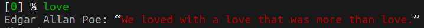

# random-quotes

Custom ZSH plugin to generate random Quotes and Facts(nerd, funny, love, inspire, facts).

## How to use?

1. Clone the repo into your custom plugins folder, usually at (~/.oh-my-zsh/custom/plugins/)

   ```bash
   git clone https://gitlab.com/vkolagotla/random-quotes.git ~/.oh-my-zsh/custom/plugins/random-quotes
   ```

2. Add `random-quotes` to .zshrc plugin list, usually at (~/.zshrc)

   ```
   plugins=(... random-quotes)
   ```

3. Type one of the words/commands in your terminal

   ```bash
   nerd
   inspire
   love
   funny
   facts
   ```

**Sample outputs**





## TODO

- [ ] Add more categories

## Inspired from

* https://github.com/oldratlee/hacker-quotes
* https://github.com/ohmyzsh/ohmyzsh/tree/master/plugins/rand-quote

## Sources

* https://github.com/oldratlee/hacker-quotes
* http://www.quotationspage.com/random.php
* https://www.generatormix.com/random-love-quotes
* https://www.generatormix.com/random-funny-quotes
* http://randomfactgenerator.net/
